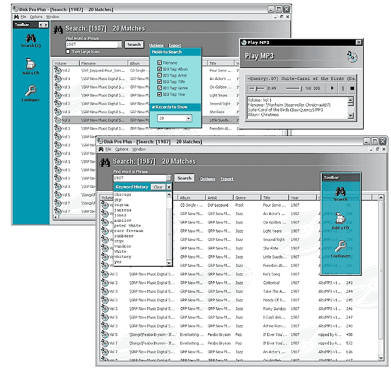



## MP3 CD Cataloger \*\*UPDATED\*\*

### Description

----

UPDATED to include an on-board MP3 Player! Now you simply double-click on the song in the search window, and Disk Pro will prompt you to insert the proper CD, and then play the song! 

----

Disk Pro is an MP3 Indexing program. If you have lots of CD's that contain MP3 files, and you need a quick way to see what CD has what song, this program is a great start! It allows you to rapidly index CD's (insert one by one), storing all file and volume information, ID tag info, and misc info like bit rate, length, etc, into a data file. You can then easily perform searches on one or more fields to locate the song(s) at a later time. I also added some extra GUI features, such as a translucent, detachable, dockable toolbar, html template reports, sortable listview, configuration page, and 99% persistent interface (it remembers everything so next time you start app, it will be the way you left it). Keywords used for searches are also maintained. The Export-To-HTML uses template files, so you can easily modify the files to format the output the way you choose. Again, with the update, you can now also PLAY the MP3 files right from within Disk Pro. It should be a good start for a great indexing program. If you like it, votes are always appreciated.
 
### More Info
 

             |
---                |---
**Submitted On**   |2002-08-20 15:08:38
**By**             |[Anthony Awx](https://github.com/Planet-Source-Code/PSCIndex/blob/master/ByAuthor/anthony-awx.md)
**Level**          |Advanced
**User Rating**    |4.9 (73 globes from 15 users)
**Compatibility**  |VB 5\.0, VB 6\.0
**Category**       |[Complete Applications](https://github.com/Planet-Source-Code/PSCIndex/blob/master/ByCategory/complete-applications__1-27.md)
**World**          |[Visual Basic](https://github.com/Planet-Source-Code/PSCIndex/blob/master/ByWorld/visual-basic.md)
**Archive File**   |[MP3\_CD\_Cat1203738202002\.zip](https://github.com/Planet-Source-Code/anthony-awx-mp3-cd-cataloger-updated__1-38084/archive/master.zip)

